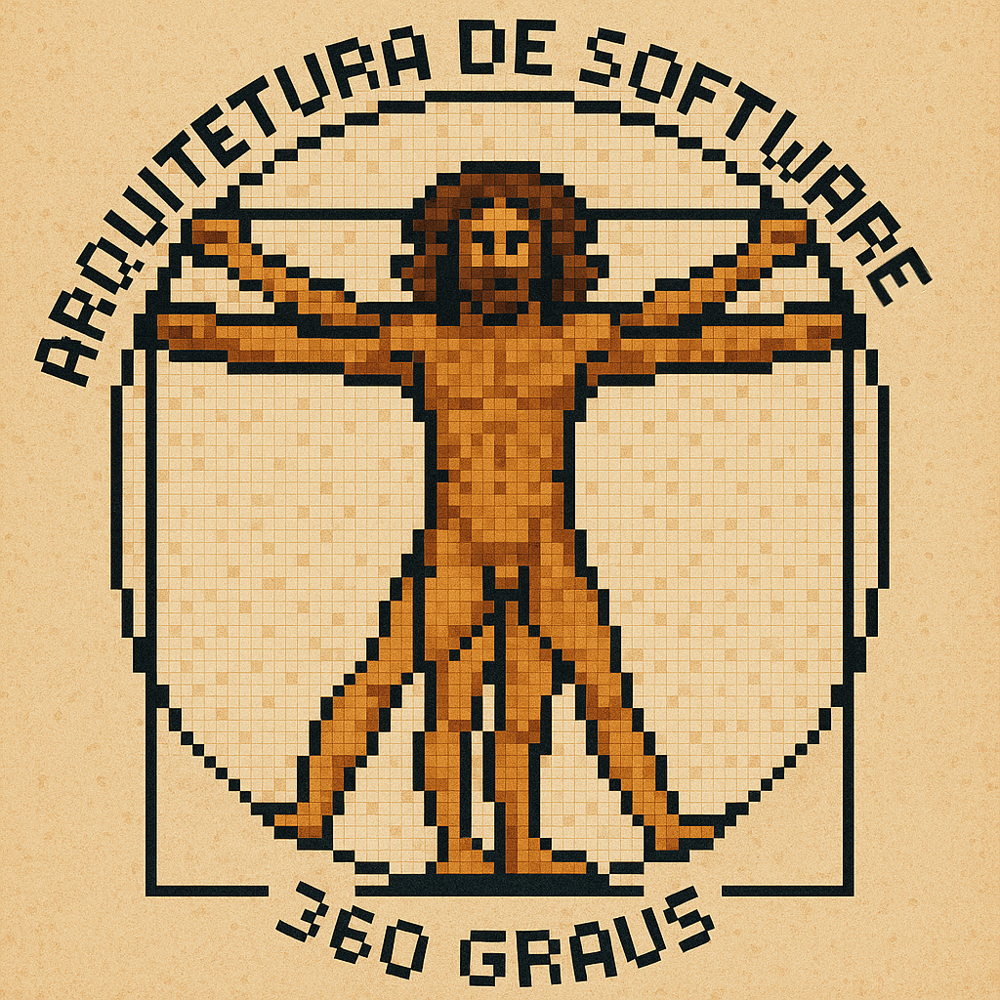

# Arquitetura de software 360 graus

[**Cleuton Sampaio**](https://linkedin.com/in/cleutonsampaio)

[**Consultoria**](https://cleutonsampaio.com)

[**Veja no GitHub**](https://github.com/cleuton/arquitetura360)

[**Youtube**](https://youtube.com/@cleutonsampaio)

[**Rusting Crab**](http://rustingcrab.com)

Bem vindas e bem vindos ao meu repo sobre **Arquitetura de Software**. Aqui, você aprende que arquitetura de software não é ser "evangelista" de produto ou framework, e que engenharia não é **clean code**.

- [**Reinforcement learning - Tutorial**](./reinforcement_learning/): Um tutorial de **RL** para você utilizar em seus projetos. 

- [**Gossip dissemination com CRDT**](./gossip-crdt/): Um estudo de caso muito interessante sobre telemetria de dispositivos industriais.
