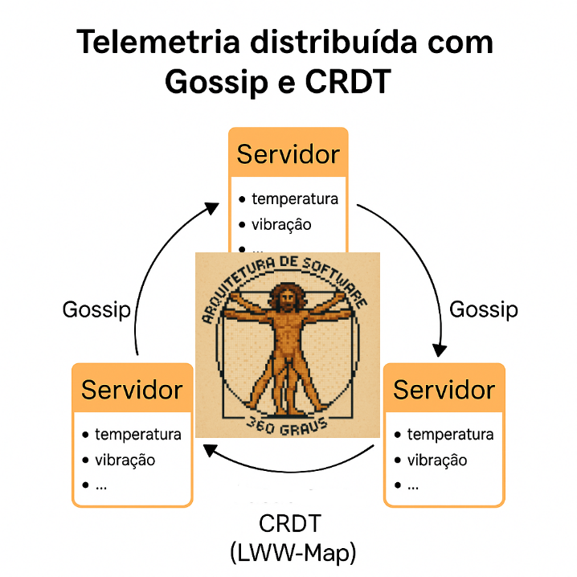

# PoC de Telemetria Distribuída

Imagine esta situação: Você tem uma grande quantidade de equipamentos industriais e precisa monitorá-los adequadamente. O uso de um nó central é impraticável. Como implementaria isso? Cada nó pode cuidar de vários equipamentos e cada um deles deve convergir para um estado combinatório. 

## Visão Geral

Esta prova de conceito avalia a viabilidade de um sistema de telemetria distribuída em que múltiplos servidores monitoram equipamentos industriais.
Cada servidor coleta métricas locais e compartilha com os demais, de modo que todos os nós mantenham acesso ao conjunto completo de métricas.
O sistema deve operar mesmo sob falhas de rede ou períodos de isolamento, com posterior reconciliação dos dados.

---

## Requisitos da PoC

* Cada servidor coleta métricas de dispositivos locais.
* Os servidores precisam compartilhar métricas entre si.
* Em caso de falha de rede, os servidores continuam úteis localmente.
* Quando a conectividade retorna, os dados devem convergir automaticamente.
* Não é permitido: broker central, banco de dados centralizado, serviço de consolidação único ou ordenação global.
* A escalabilidade deve ser horizontal, sem pontos de gargalo.

---

## Solução adotada

### Disseminação via Gossip

Cada servidor mantém uma lista de pares conhecidos e, periodicamente, envia seu estado para alguns desses pares.
Isso garante disseminação progressiva e descentralizada, sem a necessidade de coordenação global.

### Uso de CRDT

Para garantir convergência automática, utilizamos um **CRDT (Conflict-Free Replicated Data Type)**.
CRDTs são estruturas de dados que permitem **replicação distribuída com atualizações independentes** e **garantia de convergência** sem coordenação explícita.

#### Tipo de CRDT escolhido: **LWW-Map (Last Write Wins Map)**

* Cada métrica é representada por uma chave (`dispositivo:metrica`).
* O valor armazenado contém: `timestamp`, `id do nó`, `valor`.
* Na fusão de estados, sempre prevalece a entrada com o **maior timestamp** (e, em caso de empate, o maior id de nó).
* Assim, mesmo que mensagens cheguem fora de ordem, o estado final converge de forma determinística.

---

## Implementação

A PoC foi implementada em **Go, Python e Rust**, com comportamento equivalente:

* **Coleta local:** cada servidor gera métricas a cada 500 ms para até 10 dispositivos, com duas métricas (`temperatura` e `vibração`).
* **Troca de estados:** cada servidor expõe um endpoint HTTP `/gossip` para receber estados de pares.
* **Reconciliação:** ao receber dados, o servidor aplica a fusão via CRDT (LWW-Map).
* **Logs detalhados:** cada servidor grava em arquivo um log com:

  * métricas locais geradas,
  * métricas recebidas de pares remotos,
  * estado atual após cada fusão.

* **Healthcheck:** cada servidor expõe `/healthz`.
  O Docker Compose usa esse endpoint para verificar se o nó está ativo antes de iniciar dependentes.

---

## Estrutura de Pastas

```
.
├── docker-compose.yml
├── go/
│   ├── Dockerfile
│   ├── go.mod
│   └── main.go
├── python/
│   ├── Dockerfile
│   └── servidor.py
├── rust/
│   ├── Dockerfile
│   ├── Cargo.toml
│   └── src/main.rs
└── logs/        # arquivos de log são gravados aqui
```

---

## Protocolo comum (entre todas as linguagens)

* **Estado replicado**: um **LWW-Map (Last-Write-Wins Map)** onde cada chave é `dispN:metrica` e o valor é o **tripleto** `(timestamp_ms, node_id, valor)`.
* **Regra de resolução de conflitos** (merge):

  * Para a mesma chave, vence o par com **maior `timestamp`**; em empate, vence o **maior `node_id`**.
  * Propriedades: **comutativo, associativo, idempotente** → convergência eventual garantida.
* **Payload de gossip** (HTTP `POST /gossip`):

  ```json
  { "lww": [ { "key": "disp3:temperatura", "ts": 169...", "node_id": 5000, "value": 73.0 }, ... ] }
  ```

  > Observação (Python): o handler aceita **também** o formato lista/tupla `["key", ts, node_id, value]` por compatibilidade.
* **Ciclo**:

  1. Cada nó **gera métricas locais** (10 dispositivos × 2 métricas) a cada **500 ms** e faz `put`.
  2. A cada **2 s**, tira um **snapshot** e envia aos peers via **gossip** (`POST /gossip`).
  3. Ao receber, executa `merge` e registra o **estado atual** no log (por dispositivo).
* **Saúde**: `GET /healthz` retorna `ok` e é usado pelo Compose para *healthcheck*.

---

## Python (aiohttp + asyncio)

* **Estruturas principais**

  * `class LWWMap`: mantém `Dict[str, Tuple[int, int, float]]` com **`asyncio.Lock`**.

    * `put(key, ts, node_id, value)`: aplica a regra LWW.
    * `merge_many(items)`: itera `(key, ts, node_id, value)` aplicando LWW.
    * `snapshot()`: copia do estado atual.
* **Gossip**

  * **Envio**: tarefa assíncrona `disseminar()` a cada 2 s:

    * chama `snapshot()`, monta `{"lww": items}`, `POST` para cada peer de `COMPANHEIROS` usando **`aiohttp.ClientSession`**.
    * falhas de rede são logadas como `[ERRO]`.
  * **Recepção**: handler `POST /gossip`:

    * desserializa `lww`, faz *coerce* para lista de 4-tuplas (aceita dict ou tupla), chama `merge_many`.
    * loga `[REMOTO]` e, **em seguida**, loga **estado atual** por dispositivo.
* **Geração de métricas**

  * Tarefa `gerar_metricas()` a cada 500 ms:

    * para cada `dispN` e métrica `temperatura|vibracao`, faz `put` com `ts=now_ms` e **`node_id = PORTA`**.
    * loga `[LOCAL] …` e depois **`[ESTADO] Após geração local`** (snapshot agrupado).
* **HTTP / Saúde**

  * `aiohttp.web.Application` com rotas `/gossip` e `/healthz`, **bind em `0.0.0.0:PORTA`**.
* **Log**

  * **Somente arquivo**: `/logs/servidor_<PORTA>.log` (FileHandler).
  * Função `log_estado()` agrupa por `dispN` e ordena (`disp0, disp1, …`).

**Resumo Python:** *estado protegido via `asyncio.Lock`; gossip com `aiohttp`; logs após cada geração e cada merge.*

---

## Go (net/http + goroutines)

* **Estruturas principais**

  * `state map[string]Item` onde `Item{ TS int64, NodeID int, Value float64 }`.
  * Funções:

    * `put(key, ts, node, val)` → aplica LWW.
    * `mergeMany([]Entry)` → aplica LWW em lote.
    * `snapshot()` → cópia do `state`.
* **Gossip**

  * **Envio**: goroutine `disseminar()` a cada 2 s:

    * monta `Gossip{LWW: []Entry}` a partir de `snapshot()`; `POST` para cada peer com `http.Client{Timeout:3s}`.
  * **Recepção**: handler `POST /gossip`:

    * `json.NewDecoder.Decode`, `mergeMany(g.LWW)`.
    * loga `[REMOTO]` e **`[ESTADO] Após merge remoto`** (agrupado por dispositivo).
* **Geração de métricas**

  * goroutine `gerarMetricas()` a cada 500 ms:

    * atualiza `state` via `put`; loga `[LOCAL]` e depois **`[ESTADO] Após geração local`**.
* **HTTP / Saúde**

  * `net/http` com rotas `/gossip` e `/healthz`.
  * `ListenAndServe(:PORTA)`.
* **Log**

  * Redireciona **stdout/stderr para arquivo** `/logs/servidor_<PORTA>.log` com `syscall.Dup2`.
  * `logEstado()` agrupa e ordena `dispN`.

> **Nota de concorrência (PoC):** o `map` do Go é acessado por múltiplas goroutines (HTTP + geradores/propagadores). Para produção, **proteja `state`** com `sync.RWMutex` ou serialize atualizações via **canal**. Nesta PoC, mantivemos o código simples para focar no protocolo.

**Resumo Go:** *gossip e métricas em goroutines; HTTP nativo; logs direcionados a arquivo; atenção ao acesso concorrente do map.*

---

## Rust (Tokio + Axum + reqwest/rustls)

* **Estruturas principais**

  * `HashMap<String, Value>` dentro de `AppState` com `Arc<Mutex<...>>`.

    * `Value { ts: i64, node_id: u16, value: f64 }`.
    * `AppState::put()` e `merge_many()` aplicam a regra LWW (com função `greater()`).
    * `snapshot()` clona o `HashMap`.
* **Gossip**

  * **Envio**: `tokio::spawn(disseminate)` a cada 2 s:

    * lê `snapshot()`, monta `GossipMsg { lww: Vec<Entry> }`, `reqwest::Client` (TLS **rustls**) para `POST` em cada peer.
  * **Recepção**: rota `POST /gossip` (Axum):

    * desserializa `Json<GossipMsg>`, chama `merge_many`, loga `[REMOTO]` e **`[ESTADO] Após merge remoto`**.
* **Geração de métricas**

  * `tokio::spawn(generate)` a cada 500 ms:

    * monta `key`, `ts=Utc::now().timestamp_millis()`, `node_id = PORTA`, chama `put`, loga `[LOCAL]`, em seguida **`[ESTADO] Após geração local`**.
* **HTTP / Saúde**

  * Axum `Router` com `/gossip` e `/healthz`, servido por `axum::serve` em socket TCP criado por `TcpListener::bind(0.0.0.0:PORTA)`.
  * Shutdown gracioso com `tokio::signal::ctrl_c()`.
* **Log**

  * `Logger` próprio que grava **apenas em arquivo** `/logs/servidor_<PORTA>.log` com timestamp RFC3339.
  * Funções `group_by_device` + `log_estado` para imprimir snapshot por `dispN`.

**Resumo Rust:** *estado protegido por `Arc<Mutex<...>>`; tarefas assíncronas para gerar e disseminar; Axum/reqwest; logs só em arquivo.*

---

## Healthcheck e ordem de subida (Compose)

* Cada serviço expõe `GET /healthz` → `"ok"`.
* O `docker-compose.yml` usa `healthcheck` com `curl` (instalado nos runtimes) para declarar o serviço **healthy**.
* `depends_on: condition: service_healthy` evita que um nó tente fazer gossip com pares que ainda não estão prontos, reduzindo `connection refused`.

---

## O que observar nos logs (para validar convergência)

* Blocos repetidos:

  * `[LOCAL] dispX:met = v @ts=… nid=PORTA`
  * `[REMOTO] Recebidas N entradas de <peer>`
  * `[ESTADO] Após geração local ...` **ou** `[ESTADO] Após merge remoto ...`
* Compare os blocos `[ESTADO]` entre nós diferentes: após algumas rodadas, **devem mostrar o mesmo valor vigente** por chave (`dispN:metrica`), confirmando a **convergência do LWW-Map**.

Se quiser, eu adiciono uma **tabela-resumo** com os pontos de extensão (ex.: como trocar de LWW-Map para OR-Set/PN-Counter) para você evoluir a PoC sem mexer no esqueleto de rede.


---

## Como compilar e executar

### 1. Preparar ambiente

```bash
mkdir -p logs
```

### 2. Rebuild total (garante imagens atualizadas)

```bash
docker compose down -v --remove-orphans
docker compose build --no-cache
```

### 3. Subir os serviços

```bash
docker compose up
```

Isso inicia:

* 3 servidores Go (`go1`, `go2`, `go3`)
* 3 servidores Python (`python1`, `python2`, `python3`)
* 3 servidores Rust (`rust1`, `rust2`, `rust3`)

Cada um com peers configurados para trocar métricas.

---

## Verificando a execução

* Acompanhe os arquivos em `./logs/` (`servidor_5000.log`, `servidor_6000.log`, `servidor_7000.log`, etc.).
* Você verá entradas do tipo:

  * `[LOCAL]` métricas coletadas no nó.
  * `[REMOTO]` métricas recebidas de outro nó.
  * `[ESTADO]` snapshot consolidado atual.
* Com o tempo, os estados convergem e todos os nós passam a registrar o mesmo conjunto de métricas.

---

## Encerrando e limpando tudo

```bash
docker compose down -v --remove-orphans
rm -rf logs/*
```

