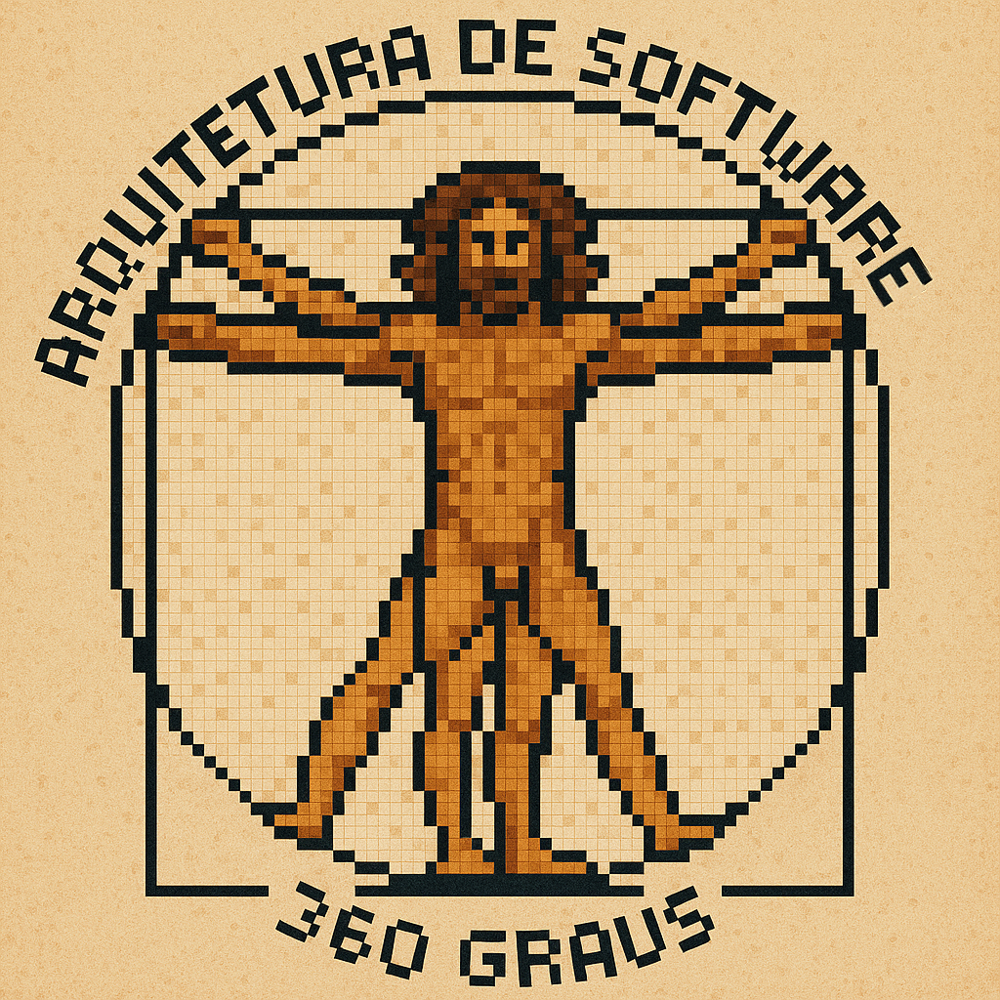
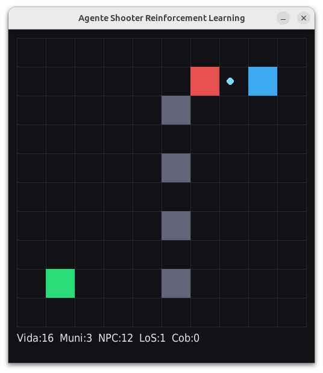

# Reinforcement Learning

## Visão geral

[**Vídeo**](https://youtu.be/nl2_e_Ar1uc)

[**Cleuton Sampaio**](https://linkedin.com/in/cleutonsampaio).

Este shooter game é um projeto didático que demonstra como Reinforcement Learning pode ser aplicado a um jogo de tiro simples em grade. O objetivo é mostrar como um agente pode aprender a sobreviver, atacar e fugir com base em recompensas, penalidades e tentativa e erro.

O ambiente contém dois personagens.
O Agente RL, mostrado em azul, é o único que aprende. Ele tenta matar o inimigo, fugir da linha de visada após atirar, buscar kits de vida quando está ferido e caixas de munição quando está sem balas.
O Inimigo, mostrado em vermelho, não usa aprendizado. Ele segue uma rotina fixa: atira quando tem linha de visada e cooldown disponível e se move de forma simples ou aleatória.

As paredes cinzas criam zonas de cobertura e bloqueiam tiros. As caixas verdes representam kits de vida e as amarelas representam munição. Durante a simulação, os tiros aparecem como círculos animados e uma mensagem curta indica quem morreu antes de o jogo reiniciar.

---

## Modos de operação

O projeto pode ser executado em dois modos.

### Modo de treino

No modo de treino o agente azul aprende a jogar por meio de tentativa e erro.
A cada episódio o jogo é reiniciado e o agente interage com o ambiente, recebendo recompensas e penalidades de acordo com suas ações.
Essas recompensas alimentam o algoritmo de aprendizado Q-Learning, que ajusta gradualmente a política de decisões do agente.

O processo gera uma tabela de valores (Q-table) que associa cada estado e ação a um valor esperado de recompensa.
Ao final essa tabela é salva no arquivo `qtable_final.pkl`.

Exemplo:

```
python agente10.py --treinar --episodios 30000
```

Durante o treino, o console exibe mensagens de progresso:

```
[ep 29700] média 2.637 | win-rate 0.364 | epsilon 0.100
```

**ep** é o número do episódio atual
**média** é a recompensa média recente (quanto maior, melhor)
**win-rate** é a proporção de vitórias (vezes em que o agente matou o inimigo)
**epsilon** representa o nível de exploração (quanto menor, mais o agente segue o que já aprendeu)

---

### Modo de demonstração

No modo de demonstração o agente utiliza apenas o conhecimento salvo durante o treino.
Nenhum aprendizado adicional ocorre. O agente apenas executa ações com base nos valores Q armazenados.
Esse modo permite observar visualmente o comportamento aprendido sem exploração aleatória.

Exemplo:

```
python agente10.py --demo
```

Durante a execução o jogo mostra:

* O Agente RL (azul) aplicando o comportamento aprendido
* O Inimigo (vermelho) com comportamento fixo
* Os kits de vida e caixas de munição
* Os tiros como esferas coloridas
* A vida, munição e cobertura exibidas na parte inferior da tela

---

## Técnicas e algoritmos utilizados

O projeto usa o algoritmo **Q-Learning**, uma técnica de **Reinforcement Learning** baseada em aprendizado por interação com o ambiente.
O agente não é instruído diretamente sobre o que fazer. Ele experimenta ações, observa o resultado e ajusta suas decisões futuras para maximizar recompensas acumuladas.

Esse processo é chamado de Reinforcement Learning porque o comportamento é moldado por reforços positivos e negativos.
Cada ação gera uma consequência e as boas consequências são reforçadas, enquanto as más são punidas.

Características principais:

* Aprendizado por reforço: o agente aprende com experiência, não com exemplos prontos
* Ambiente interativo: o estado muda em resposta às ações
* Exploração e exploração do conhecimento: o agente alterna entre testar novas ações e repetir as melhores
* Função de valor: a tabela Q estima a qualidade esperada de cada ação em cada estado

A atualização segue a fórmula:

```
Q(s,a) = Q(s,a) + α * [r + γ * max(Q(s',a')) - Q(s,a)]
```

α é a taxa de aprendizado
γ é o fator de desconto
r é a recompensa imediata
s e s' são o estado atual e o próximo

Com o tempo o agente converge para um comportamento eficiente, balanceando agressividade e autoproteção.

---

## Estrutura do código

O aprendizado e o ambiente estão divididos em duas classes principais.

### Classe `JogoAcaoEnv`

Representa o ambiente. Define mapa, colisões, tiros e sistema de recompensas.
Cada chamada ao método `step()` executa uma ação e retorna o novo estado, a recompensa e se o jogo terminou.

```python
s2, r, fim, _ = env.step(a)
```

As recompensas são calculadas conforme a situação.
Exemplo de incentivo pós-tiro:

```python
if dt in (1, 2):
    if not self._inimigo_tem_visada():
        recompensa += 0.70
    if dist_now > dist_prev:
        recompensa += 0.25
    if self.em_cobertura:
        recompensa += 0.35
```

O agente ganha bônus ao sair da linha de visada, aumentar distância e entrar em cobertura após atirar.

---

### Classe `AgenteQLearning`

Mantém e atualiza a tabela Q.
Cada par estado-ação tem um valor que é ajustado conforme as recompensas observadas.

```python
def atualizar(self, s, a, r, s2, fim):
    qsa = self.Q[(s, a)]
    if fim:
        alvo = r
    else:
        max_q = max(self.Q[(s2, a2)] for a2 in range(self.n_acoes))
        alvo = r + self.gama * max_q
    self.Q[(s, a)] = qsa + self.alfa * (alvo - qsa)
```

A tabela é salva após o treino e carregada na demonstração:

```python
with open("qtable_final.pkl", "wb") as f:
    pickle.dump(dict(agente.Q), f)
```

```python
if os.path.exists("qtable_final.pkl"):
    with open("qtable_final.pkl", "rb") as f:
        agente.Q.update(pickle.load(f))
```

---

## Expectativas de comportamento

Após treino suficiente (cerca de 30 a 50 mil episódios), o agente azul tende a:

* Atirar e se mover para fora da linha de visada
* Usar paredes como cobertura
* Buscar vida e munição quando está em desvantagem
* Evitar ficar parado e se proteger melhor
* Reduzir mortes causadas por exposição

O inimigo vermelho mantém comportamento fixo e serve apenas como referência para o aprendizado.

---

## Casos de uso de Reinforcement Learning

Reinforcement Learning não se limita a jogos. O mesmo princípio pode ser aplicado a muitos outros tipos de problema que envolvem interação contínua, decisão e otimização de longo prazo.

### Simulações de controle

* Robôs aprendendo a andar, equilibrar objetos ou navegar em terrenos irregulares
* Drones ajustando altitude e trajetória com base em vento e obstáculos
* Braços robóticos aprendendo a manipular peças em uma linha de montagem

### Simulações industriais e logísticas

* Otimização de rotas de transporte e entrega
* Controle de estoques e fluxos de produção
* Gestão de energia em fábricas ou redes elétricas inteligentes

### Finanças e economia

* Agentes simulando estratégias de investimento e controle de risco
* Modelagem de negociação adaptativa em mercados complexos

### Saúde e pesquisa

* Ajuste dinâmico de doses em terapias automatizadas
* Simulações de comportamento celular ou molecular sob estímulos

### Computação e sistemas

* Alocação de recursos em datacenters e nuvens computacionais
* Aprendizado de políticas para balanceamento de carga ou escalonamento de processos

Em todos esses casos, o princípio é o mesmo: o agente interage com um ambiente, observa as consequências e ajusta suas decisões para maximizar um objetivo definido por recompensas.

---

## Possíveis melhorias

* Substituir a tabela Q por uma rede neural (Deep Q-Learning)
* Usar memória de replay para acelerar a convergência
* Incluir múltiplos inimigos com padrões variados
* Introduzir ruído de observação para treinar resiliência
* Expandir o mapa e testar políticas mais complexas
